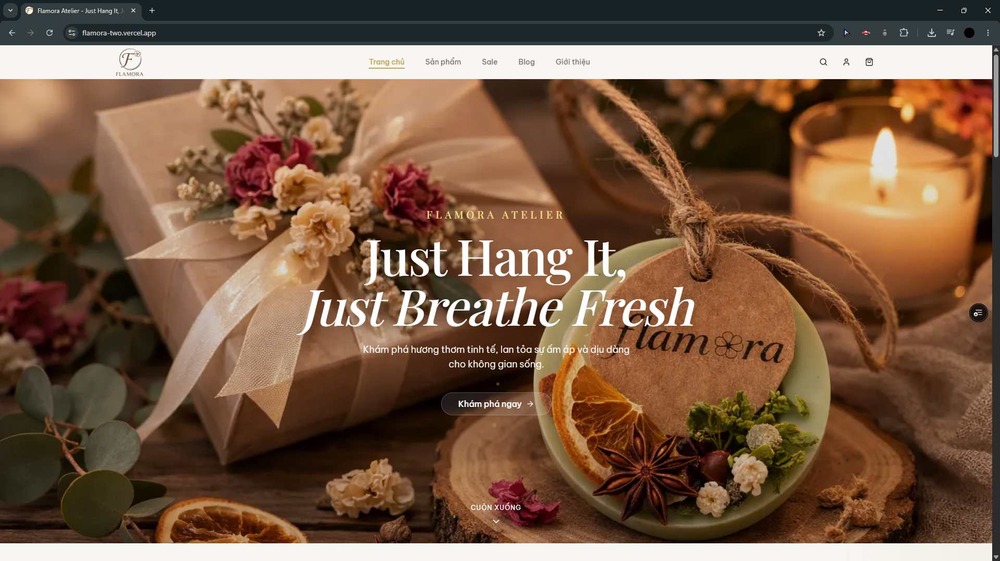

# Flamora Atelier

Flamora Atelier is a personal vibe coding project built as a Next.js e-commerce website for a fictional scented wax and candle brand. The project is used to practice fast product-building workflows, experiment with modern interface ideas, and explore how frontend, authentication, database persistence, and AI-assisted features can work together in a complete web application.

The application includes a storefront, product browsing, cart and checkout flows, authentication, order persistence, and an admin-only scent narrative generator.

## Preview



## Main Features

- Homepage, about page, sale page, blog pages, category pages, product listing, and product detail pages.
- Product filtering, pagination, product gallery, scent/color selection, and cart sheet.
- Checkout flow with server-side validation.
- Credentials-based authentication with NextAuth.
- User registration API with bcrypt password hashing.
- SQLite persistence for users, orders, and order items through Prisma.
- Account and order history pages for signed-in users.
- Admin pages, including a scent narrative generator.
- Responsive UI built with Tailwind CSS and Radix UI components.

## Tech Stack

- Next.js 15 App Router
- React 19
- TypeScript
- Tailwind CSS
- Radix UI
- NextAuth
- Prisma ORM
- SQLite
- Zod
- Framer Motion

## Requirements

- Node.js 20 or newer
- npm
- Git

On Windows PowerShell, if `npm` is blocked by the execution policy, use `npm.cmd` in place of `npm`.

## Code Structure

```text
Flamora/
|-- prisma/
|   |-- schema.prisma          # Prisma models for users, orders, and order items
|   `-- seed.ts                # Demo admin/user account seed script
|-- public/
|   |-- imgs/                  # README and site images
|   `-- sap_thom/              # Product images
|-- src/
|   |-- ai/
|   |   `-- flows/             # AI scent narrative generation logic
|   |-- app/                   # Next.js App Router routes
|   |   |-- api/               # API routes
|   |   |-- admin/             # Admin pages
|   |   |-- blog/              # Blog pages
|   |   |-- cart/              # Cart page
|   |   |-- category/          # Category pages
|   |   |-- checkout/          # Checkout page
|   |   |-- orders/            # Order history and detail pages
|   |   `-- san-pham/          # Product listing and product detail pages
|   |-- components/
|   |   |-- auth/              # Auth UI helpers
|   |   |-- cart/              # Cart icon and cart sheet
|   |   |-- layout/            # Header, footer, homepage sections
|   |   |-- products/          # Product cards, filters, gallery, add-to-cart form
|   |   `-- ui/                # Reusable UI primitives
|   |-- context/               # App providers, auth provider, cart state
|   |-- data/                  # Mock product/category/blog data
|   |-- hooks/                 # Shared React hooks
|   |-- lib/                   # Server actions, auth config, Prisma client, stores, utilities
|   |-- types/                 # Shared TypeScript types
|   `-- middleware.ts          # Route middleware config
|-- .env.example               # Example environment variables
|-- package.json               # Scripts and dependencies
`-- README.md
```

## Environment Variables

Create a local `.env` file from the example file:

```bash
cp .env.example .env
```

On Windows PowerShell:

```powershell
copy .env.example .env
```

Required variables:

```env
DATABASE_URL="file:./dev.db"
NEXTAUTH_SECRET="replace-with-a-secure-secret"
```

Recommended for local development:

```env
NEXTAUTH_URL="http://localhost:9002"
```

Optional for the scent narrative generator:

```env
GEMINI_API_KEY="your-gemini-api-key"
```

The AI action also accepts `GOOGLE_GENAI_API_KEY` or `GOOGLE_API_KEY`.

## Installation

Install dependencies:

```bash
npm install
```

Windows PowerShell fallback:

```powershell
npm.cmd install
```

The project has a `postinstall` script that runs `prisma generate` automatically.

## Database Setup

Generate the Prisma Client:

```bash
npm run db:generate
```

Create or update the local SQLite database:

```bash
npm run db:push
```

Seed demo users:

```bash
npm run db:seed
```

After seeding, the local SQLite database is created under the `prisma/` directory based on `DATABASE_URL`.

## Running Locally

Start the development server:

```bash
npm run dev
```

Open:

```text
http://localhost:9002
```

The dev script runs Next.js with Turbopack on port `9002`.

## Production Build

Create a production build:

```bash
npm run build
```

Start the production server:

```bash
npm run start
```

## Demo Accounts

These accounts are created by `npm run db:seed`.

```text
Admin: admin@flamora.vn / Admin123!
User:  user@gmail.com / User123!
```

## Available Scripts

```bash
npm run dev          # Start the development server on port 9002
npm run build        # Create a production build
npm run start        # Start the production server
npm run typecheck    # Run TypeScript checks
npm run db:generate  # Generate Prisma Client
npm run db:push      # Sync Prisma schema to SQLite
npm run db:seed      # Seed demo users
```

## Development Notes

- Product, category, and blog content currently come from `src/data/mock-data.ts`.
- User accounts, order records, and order items are persisted with Prisma and SQLite.
- Cart state is client-side and managed through `src/context/cart-context.tsx`.
- Authentication is configured in `src/lib/auth-options.ts`.
- Order creation and scent narrative generation are server actions in `src/lib/actions.ts`.
- Local environment files, generated database files, and build output should not be committed.

## Troubleshooting

If PowerShell blocks `npm`, run commands with `npm.cmd`:

```powershell
npm.cmd install
npm.cmd run dev
```

To allow normal `npm` usage for the current Windows user:

```powershell
Set-ExecutionPolicy -Scope CurrentUser RemoteSigned
```

If Prisma Client is missing or stale:

```bash
npm run db:generate
```

If the database schema is out of sync:

```bash
npm run db:push
```

If login fails for demo accounts, reseed the database:

```bash
npm run db:seed
```
